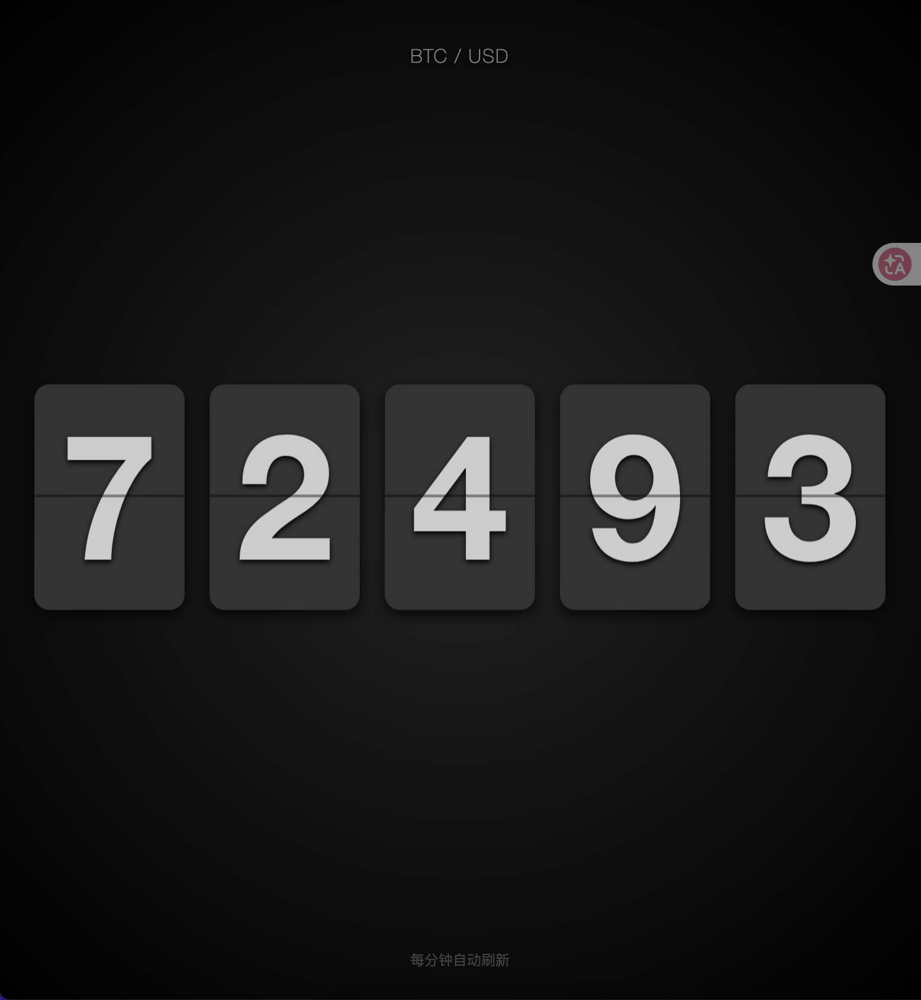

# BTC 机械翻页时钟
一个极简且酷炫的实时比特币（BTC）价格显示器，采用经典的机械翻页钟风格设计。它能自动从币安（Binance）获取最新的 BTC/USD 价格，并具备强大的自适应缩放功能，完美适配各种屏幕尺寸。
## ✨ 特性
- 🕰️ **复古机械风格**: 使用 FlipClock.js 库实现逼真的机械翻页动画效果。
- 📡 **实时数据**: 通过 Binance Open API 自动获取最新的 BTC/USD 价格。
- 📱 **智能缩放**: 内置自适应算法，无论是在手机竖屏、宽屏显示器还是横屏模式下，时钟都能自动调整大小以完美适配屏幕，且不溢出。
- 🎬 **流畅动画**: 价格更新时包含翻转与位移动画，视觉体验顺滑。
- ⚡ **自动刷新**: 每分钟（60秒）自动刷新一次价格数据。
- 🎨 **暗黑极简风**: 深色径向渐变背景，适合作为桌面挂件或屏幕保护程序使用。
## 🛠️ 技术栈
- **HTML5**: 语义化结构。
- **CSS3**: Flexbox 布局、关键帧动画及媒体查询（横竖屏适配）。
- **JavaScript (ES6+)**: 核心逻辑控制。
- **jQuery**: DOM 操作与 AJAX 请求。
- **FlipClock.js**: 核心翻页动画组件（CDN 引入）。
## 📸 效果预览

## 🚀 快速开始
无需安装任何后端环境或依赖包，直接在浏览器中打开即可使用。
1.  **获取代码**
    将代码保存为 `index.html` 文件。
2.  **运行**
    直接双击 `index.html` 文件，使用 Chrome、Edge、Firefox 或 Safari 等现代浏览器打开。
3.  **查看**
    页面加载后会自动请求 API 并显示当前的 BTC 价格。
## ⚙️ 自定义配置
如果你需要修改交易对（如显示 ETH）或调整刷新频率，可以编辑 `<script>` 标签内的代码：
- **1. 修改交易对**
找到 `fetchBTCPrice` 函数中的 `url` 参数：
    url: 'https://api.binance.me/api/v3/ticker/price?symbol=ETHUSDT', // 修改为其他币种
- **2. 修改刷新时间**
找到代码底部的 `setInterval`：
    setInterval(fetchBTCPrice, 30000); // 修改为 30000 表示每 30 秒刷新一次
## 📝 核心实现逻辑
- **双层容器结构**:
  - `scale-wrapper`: 负责整体的 `transform: scale()` 缩放，确保时钟在任何分辨率下都不溢出屏幕。
  - `anim-wrapper`: 负责内部的翻转与位移动画。
- **自动缩放算法 (`autoScaleClock`)**:
  - 动态计算当前窗口的宽高。
  - 基于时钟原始尺寸与目标窗口尺寸的比例，取宽高比例的最小值作为缩放因子 (`Math.min`)，保证内容完整显示。
- **横竖屏适配**:
  - 通过 CSS `@media (orientation: landscape)` 查询，在横屏模式下自动隐藏标题和页脚，提供沉浸式的大字显示体验。
## ⚠️ 注意事项
- 本项目直接调用 Binance 的公共 API。如果网络环境无法访问 `api.binance.me`，可能无法获取数据（请确保网络连接正常或使用代理）。
- 依赖的 jQuery 和 FlipClock 库均通过 CDN 加载，请确保设备已连接互联网。
## 📄 License
MIT License